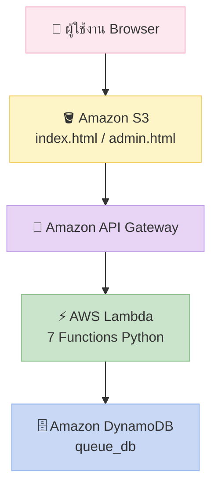

<div align="center">

# ระบบจองคิวออนไลน์บน AWS
### Cloud Queue Booking System


<br/>

**วิชา ICT24467** — การพัฒนาซอฟต์แวร์ระบบประมวลผลคลาวด์และความปลอดภัยของข้อมูล

มหาวิทยาลัยศรีปทุม ภาคการศึกษาที่ 2 ปีการศึกษา 2568

</div>

---

## 🌸 สมาชิกกลุ่ม

| ชื่อ | รหัสนักศึกษา |
|:-----|:------------:|
| นางสาว วิภาภรณ์ ปลอดสันเทียะ | 67094859 |
| นางสาว ณัฐชา แล้วกระโทก | 67126501 |
| นางสาว ทิวารัตน์ อัมฤทธิ์ | 67167139 |
| นางสาว พลอยลดา สุขภักดีธนพงศ์ | 67171448 |

---

## 🏗️ สถาปัตยกรรมระบบ


---

## ☁️ เทคโนโลยีที่ใช้

| บริการ | หน้าที่ |
|:-------|:--------|
| 🗄️ Amazon DynamoDB | จัดเก็บข้อมูลคิวทั้งหมด |
| ⚡ AWS Lambda | ประมวลผล Backend (Python) |
| 🔗 Amazon API Gateway | เปิด HTTP API ให้หน้าเว็บเรียกใช้ |
| 🪣 Amazon S3 | Host หน้าเว็บไซต์แบบ Static |

---

## ⚡ Lambda Functions ทั้ง 7 ฟังก์ชัน

| ฟังก์ชัน | Method | Path | หน้าที่ |
|:---------|:------:|:-----|:--------|
| `createQueue` | POST | `/queue` | สร้างคิวใหม่ |
| `getQueues` | GET | `/queues` | ดูคิวทั้งหมด (แอดมิน) |
| `getQueueByPhone` | GET | `/queue-by-phone` | ค้นหาคิวด้วยเบอร์โทร |
| `getCurrentQueue` | GET | `/current-queue` | ดูคิวปัจจุบัน |
| `nextQueue` | POST | `/next-queue` | เรียกคิวถัดไป |
| `updateQueueStatus` | POST | `/update-status` | อัปเดตสถานะคิว |
| `clearAllQueues` | POST | `/clear-queues` | ล้างคิวทั้งหมด |

---

## 📁 โครงสร้างโปรเจกต์

```
queue-system-aws/
├── README.md
├── frontend/
│   ├── index.html
│   └── admin.html
└── lambda/
    ├── createQueue.py
    ├── getQueues.py
    ├── getQueueByPhone.py
    ├── getCurrentQueue.py
    ├── nextQueue.py
    ├── updateQueueStatus.py
    └── clearAllQueues.py
---

## 🌐 ลิงก์เว็บไซต์จริง

<div align="center">

| หน้า | ลิงก์ |
|:----:|:------|
| 👤 หน้าลูกค้า | [index.html](https://queue-web-2026.s3.ap-southeast-1.amazonaws.com/index.html) |
| 🔧 หน้าแอดมิน | [admin.html](https://queue-web-2026.s3.ap-southeast-1.amazonaws.com/admin.html) |

</div>

---

## 🔄 การทำงานของระบบ

**🧍 ฝั่งลูกค้า**
1. 📝 กรอกชื่อและเบอร์โทร → ยืนยัน PDPA → จองคิว
2. 🔍 ตรวจสอบสถานะคิวด้วยเบอร์โทร
3. ❌ ยกเลิกคิวด้วยตนเอง

**🛠️ ฝั่งแอดมิน**
1. 📋 ดูรายการคิวทั้งหมดแบบ real-time
2. ➡️ เรียกคิวถัดไป
3. 🗑️ ยกเลิกหรือรีเซ็ตคิวทั้งหมด

---

<div align="center">
  <sub>🌷 เสนอ อาจารย์ อำนาจ คงเจริญถิ่น &nbsp;|&nbsp; มหาวิทยาลัยศรีปทุม 2568 🌷</sub>
</div>
